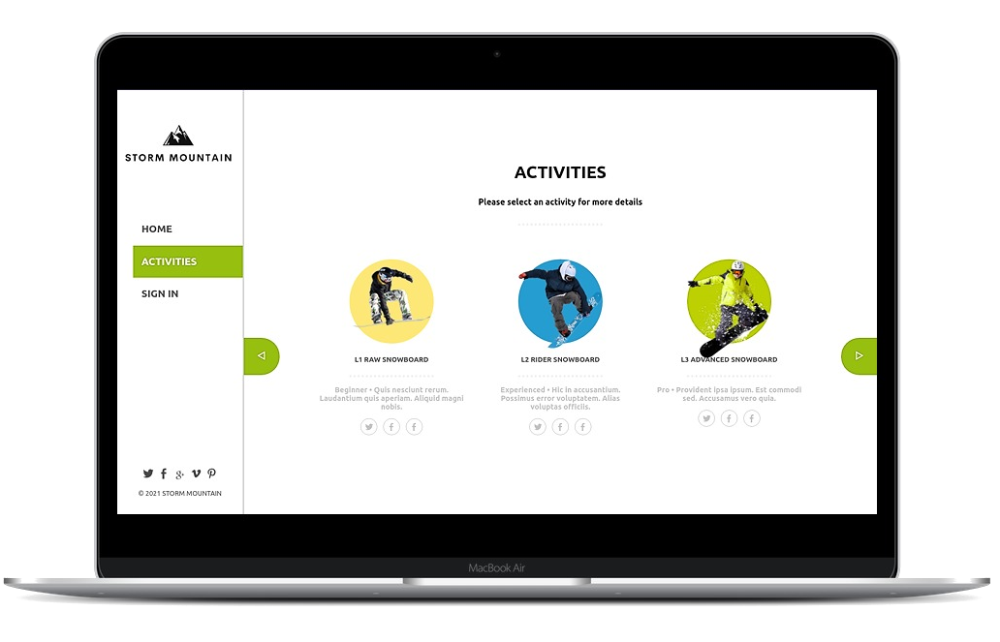

# Storm Mountain

> This is a website focused on winter sports. The goal is to allow users create accounts,
> pick one sport and book classes.
> Built with React and Redux and the Storm Mountain API



## Built With

- React
- Redux
- HTML
- CSS
- ESLint
- Stylelint
- Webpack
- Node
- Yarn
- Jest
- Iconify
- Axios
- react-spinners
- react-calendar


## Live version

You can check the live version in [this link](https://storm-mountain.netlify.app/)

## Getting Started

To run this project locally, make sure you have the following installed:

- Node.js, more information [here](https://nodejs.org/en/)

### Setup and Install

- Clone the repository `git clone https://github.com/gscarv13/ss-front-end.git`
- Move to the cloned repository `cd ss-front-end`
- Run `yarn install` to set up all dependencies
- Run `yarn start` to initiate development server

### Usage

- Open your browser
- Enter `localhost:3000`

### Tests

To run the tests, open the terminal and enter the following command,

```terminal
yarn test
```

Then follow the instructions provided

## Authors

👤 **Gustavo Carvalho**

- GitHub: [@gscarv13](https://github.com/gscarv13)
- Twitter: [@Gscarv13](https://twitter.com/Gscarv13)
- LinkedIn: [Gustavo Carvalho](www.linkedin.com/in/gscarv13)

## 🤝 Contributing

Contributions, issues, and feature requests are welcome!

Feel free to check the [issues page](https://github.com/gscarv13/react-catalogue/issues).

## Show your support

Give a ⭐️ if you like this project!

## 📝 License

This project is [MIT](LICENSE) licensed.